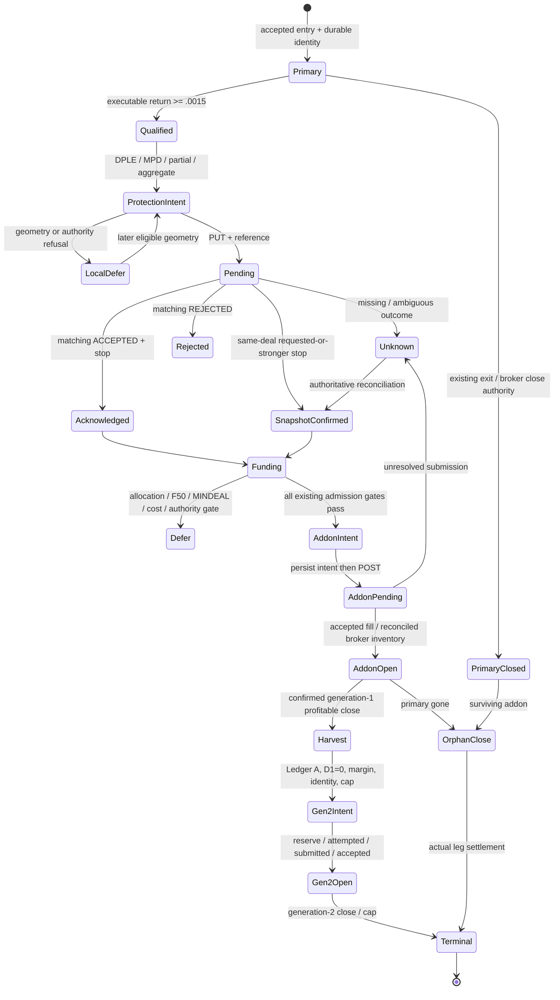

# Compounding foundation repair at 06b600f

This candidate corrects protection amendment geometry and adds decision evidence.
It does not authorize deployment or change the winner-compounding policy.

## Units and the proven defect

`_live_fetch_market_data` stores `pip` in the cash/display convention and
`price_unit` as the conversion from the native price convention. The existing
order sizing function `_live_compute_stop_pts` uses
`native_price * price_unit * stop_fraction / pip`. Its inverse is
`native_distance = broker_points * pip / price_unit`.

The amendment guards instead used `(minimum_points + 1) * pip`. That loses the
division by `price_unit`. Friday's retained startup metadata gives:

| Instrument | pip | price_unit | Minimum points | Old buffered native minimum | Correct buffered native minimum |
|---|---:|---:|---:|---:|---:|
| HO | .01 | .01 | 50 | .51 | 51 |
| OIL | .01 | .01 | 6 | .07 | 7 |
| NATGAS | .01 | .01 | 10 | .11 | 11 |
| SILVER | .01 | .01 | 4 | .05 | 5 |
| GOLD | 1 | 1 | 1 | 2 | 2 |
| COCOA | 1 | 1 | 10 | 11 | 11 |
| SUGAR | 1 | 1 | 1 | 2 | 2 |

Rules can change; this table describes retained Friday metadata, not permanent
broker specifications. `protection_geometry.amendment_geometry` uses the current
cached values, includes the existing one-point buffer and dynamic percentage
minimum, and checks the signed distance to the same normalized strongest target
that `protect` would submit. Malformed geometry defers without stopping exits.

At NATGAS midpoint 3059.5, proposed stop 3053.49966 and spread about 3 native units,
the distance is 6.00034. The old guard admits it against max(.11, 3.01); the repaired
guard defers it against max(11, 3.01). The intended stop remains 3053.49966.
This changes amendment eligibility and indirectly when broker protection can
fund F50. It does not redefine the economic stop, F50 reserve or qualification.
The correction covers DPLE, partial-TP sync, MPD sync, retry and aggregate sync.
The existing spread buffer remains `spread_native + pip`; MPD's economic pip
reserve remains unchanged. Retry/aggregate retain their prior minimum-only policy.

| Quantity / boundary | Unit and authority |
|---|---|
| IG quote, fill, absolute stop | Native broker level; confirmation/snapshot is authoritative for fills/stops |
| Commodity display conversion | Native level times price_unit; never applied a second time to a broker level |
| Broker point in native price | pip / price_unit, inverse of existing order stop sizing |
| Stop order distance | Broker points, integer sizing and existing +1 buffer |
| POINTS minimum | Cached dealing rule in broker points, converted to native price |
| PERCENTAGE minimum | Rule value / 100 as fraction; native midpoint times fraction, dynamically recomputed |
| Return, DPLE fraction, trigger | Dimensionless fraction; .0015 means +.15%, .00491961 means +.491961% |
| spread_pct, signal changes | Percentage numbers; divide by 100 for native spread, by 200 for half spread |
| ATR | Native price distance; spread / ATR is dimensionless |
| ig_size / MINDEAL | Broker contracts or instrument-specific units, not allocation dollars |
| Actual notional | Existing unit_exposure(fill) times actual quantity; commodity retained override is native dollar-point convention |
| USD P&L | Signed native price difference / fill times actual entry notional |
| Broker margin | Actual notional times broker margin fraction; distinct from chosen leverage |
| Allocation consumed | Actual notional / chosen leverage, using unchanged certified partial-release/reservation policy |
| Campaign capacity | Usable equity times unchanged tier risk fraction; remaining is capacity minus consumed/reserved allocation |
| Protected dollars | Broker-supported residual stop liquidation value less unchanged spread/slippage/commission reserves |
| F50 allowance | Unchanged half of certified protected dollars; software intent is never its authority |
| Rolling fuel | Confirmed realized Ledger A minus deployed/committed reservations; released margin is not realized profit |

## Broker contract and protection states

IG exposes normal and controlled-risk stop minimums with POINTS/PERCENTAGE units,
plus snapshot scaling/decimal metadata. This amendment path requests an absolute
`stopLevel` with `guaranteedStop=False`; controlled-risk distance/premium rules
are not substituted for its normal-stop rule. A PUT returns a reference, not an
accepted stop. June requires a matching reference, ACCEPTED, the actual position
identity at top level or in affectedDeals, and the echoed normalized stop. A
same-deal position snapshot can independently prove requested-or-stronger coverage.
These authority predicates are unchanged.

Sources: [IG market contract](https://labs.ig.com/reference/markets-epic.html),
[IG amendment contract](https://labs.ig.com/reference/positions-otc-deal-id.html),
[IG confirmation contract](https://labs.ig.com/reference/confirms-deal-reference.html).

Five-decimal rounding towards stronger protection is the existing request
normalization, not a new claim about every instrument's tick grid. Metadata can
be stale and June's retained midpoint can differ from IG's current executable
quote. `REQUEST_ELIGIBLE` describes local geometry only; broker acceptance remains
authoritative. The old "too close" suffix meant every false synchronization
result, including a submitted request awaiting acknowledgement.

| Recorded status | Meaning |
|---|---|
| NOT_REQUESTED | No request submitted at this observation |
| LOCALLY_TOO_CLOSE | Correctly converted local geometry refused this target |
| UNKNOWN_GEOMETRY | Missing/invalid inputs; no fabricated distance |
| BROKER_REQUEST_PENDING | Submitted/reused reference, awaiting matching confirmation |
| UNKNOWN_OUTCOME | Missing reference/ambiguous response; no acceptance inferred |
| BROKER_ACKNOWLEDGED | Matching accepted confirmation or explicitly retained broker evidence |
| BROKER_REJECTED | Matching broker rejection |
| BROKER_SNAPSHOT_CONFIRMED | Same-deal snapshot proved requested-or-stronger stop |
| BROKER_POSITION_GONE | Existing LS or REST-plus-activity close authority proved disappearance |

For a fresh authoritative quote and known rule/grid, the nearest geometrically
eligible normal stop can be calculated on the correct side of that quote,
rounding away from the market. Its profit must be valued at that weaker level.
This candidate does not substitute such a stop: doing so changes economic intent
and can conflict with the strongest-floor ratchet. It retains intent, defers, and
waits for broker evidence. Retained evidence does not prove unsafe exposure caused
by the old unit defect; it proves bad eligibility and misleading diagnostics.

## Pipeline and authorities

| Transition / source | Reads -> writes; units; authority and deferral |
|---|---|
| `_live_try_entry`, `_live_open_position` | Existing entry score, cash/margin, geometry -> accepted primary + broker_entry_evidence; contracts/native/USD; broker confirmation or unresolved intent, unchanged |
| `_live_check_pyramid_entry` | Executable reconstructed bid/offer and entry -> diagnostic decision; fractional return >= .0015; no submit authority from qualification alone |
| `_live_defensive_scaling_evidence`, `defensive_scaling.snapshot` | Actual residual quantities, broker-supported stops, costs -> protected-profit estimate/readiness; USD; unknown identity/overnight/quotes/history fails closed |
| `_live_check_exit`, `_live_partial_tp_exit` | Existing DPLE half-peak / MPD / breakeven intent -> existing software fields; fractional economic floors and native prices; unchanged polling exit authority |
| geometry then `_live_protect_stop`, `winner_protection.protect` | Native strongest normalized target + converted rule -> existing intent/stop_sync; local defer or pending reference; no synthetic broker fields |
| `protect`, `reply_targets_deal` | Matching confirmation/reference/affectedDeals/stop -> acknowledged_stop_level/broker_stop_level; native price; rejected/unknown retains software intent |
| `_live_reconcile_positions`, `reconcile_broker_stop` | Same actual broker deal/stop -> snapshot acknowledgement only when it covers pending intent; weaker snapshot leaves request unresolved |
| `winner_accounting.campaign_allocation` | Actual fill/quantity/leverage, confirmed partials, pending reservation -> remaining allocation; USD; unknown sizing/refunds never creates capital |
| `_live_add_pyramid_leg` | Unchanged protection, F50, MINDEAL rounding, margin, spread cost/inventory and commission -> candidate quantity/notional/risk and decision; contracts/USD/native distances; first refusal retained |
| addon submit / confirm | Durable pending intent then original POST then confirmation -> existing leg or unresolved/rejected state; no new broker calls; observations record each boundary |
| aggregate protection | Existing campaign_stop ratchet -> each leg's normalized request and corrected eligibility; native prices; acknowledgement authority unchanged |
| `_live_check_pyramid_exits`, `_live_close_addon_leg` | Existing stop/TP/giveback/reversal/orphan conditions -> original close/settlement; broker outcome determines actual closure, not a quote touch |
| `_live_record_rolling_harvest` | Confirmed gen-1 close and existing campaign identity -> realized harvest/capacity slot; USD realized estimate/provenance; unsupported close cannot credit fuel |
| `_live_evaluate_rolling_replacement`, `_live_v1_submit_gen2_replacement` | Existing return/momentum/identity/authority/margin/A/B ledgers/D1/cap -> reservation and 1xMINDEAL gen-2; structured early defer reasons; economics unchanged |
| `rolling_fuel`, `_live_settle_gen2_reservation` | RESERVED -> ATTEMPTED -> SUBMITTED -> OPEN -> terminal; dollars/deal identity; unknown outcomes keep fuel committed, releases require proven absence |
| `_live_settle_primary_exit`, orphan handler | Broker-confirmed primary/leg outcomes -> unchanged settlement identities and cleared rolling state; historical settlement records are not rewritten |

## Event model, identity and retention

The existing telemetry identity is SHA-256 of JSON `[account, primary_deal_id]`,
with a durable `links(account, deal, campaign)` table. It survives restart and
orphan-only management. The settlement namespace and `b4a_campaign_id` remain
unchanged. Recorded legs additionally carry explicit generation, primary and
parent IDs; gen-2's parent is the confirmed harvest deal. No second identity is
added to live state or Redis.

Schema-2 observations retain private quote evidence/source/receipt time, rule
units, entry receipt, actual leg quantities/stops, existing campaign estimates,
cached equity and its timestamp when available, allocation and full decision
fields, broker-only gross-at-stop (explicitly before uncertified costs), known
F50/MINDEAL/cost/inventory gates, candidate margin estimate, rolling state and
confirmation receipts. Quote observation never changes the signal payload.
MFE/MAE remain sampled campaign extrema, not intrabar extrema.

`decision_view` gives the ordered gate names, the actual terminal reason and all
known evidence. Unreached/unrecorded gates are `UNOBSERVED`, never manufactured
passes. Rolling uses its existing separate gate sequence, with early deferrals
now recorded as `v1_gen2_gate` and full admitted ledger inputs retained.

Critical events are copied into `compounding_events` in the existing SQLite,
deduplicated by the existing event identity and deleted only with whole closed
campaigns (30 days / newest 2,000 closed campaigns). Generic events/samples/path
keep their existing caps. SQLite keeps the existing 128 MiB page cap; active
critical chains are not silently trimmed. Exhaustion/disk/lock failures keep
trading behavior and write a bounded persistent `.coverage.json` failure marker.
Any recorded gap conservatively invalidates complete-chain certification; a
missing marker is also not certification. Marker-write failure is explicitly
logged as UNKNOWN. No unbounded Redis archive is introduced.

The offline reader `compounding_observation.reconstruct` consumes structured
SQLite events only. Its CLI opens SQLite with `mode=ro`. It requires qualification,
request/ack evidence, approved funding/allocation/MINDEAL/cost/inventory evidence,
identity-matched addon receipts, observed closure and gap-free recording to label
a decision chain complete. It does not certify continuous ticks, hypothetical
acceptance, final net broker P&L or missing historical events. A future campaign
that never submits an addon is still reconstructable as a refusal; it does not
receive a successful-addon certificate.

## Contracts and validation

Barbie reads `june_live_enabled` and `june_live_state`; Miss Secretary reads
`june_signals`; Claudia reads `june_live_trade_history_full`, falls back to
`june_live_state.trade_history`, and publishes/reads correlation keys. Their code
is untouched. June's Redis key constants, state/history publication, signal
schema, market/regime/correlation contracts and broker-ledger retention are
unchanged. No new telemetry Redis key is published.

Regression fixtures use the retained Friday NATGAS primary Q9AB5AT (.1@3049),
partial .05@3054, residual .05@3063 and addon RGFULA9 (.01@3074, close3061).
Equivalent mocked instrumentation yields primary +.95, addon -.13, campaign
+.82; observed qualification +.295156%, later F50 protected .649995 and legal
addon .01. Restart, snapshot coverage, generic cap=4, actual receipts, subsequent
duplicate-quote refusal and orphan closure are reconstructed without journal text.
This does not fill missing events in the historical production archive.

Freeze tests compare every top-level assignment and the AST of entry scoring,
universe metadata loading, primary sizing, stop sizing, entry, CB, balance polling,
primary/addon exits, pyramid qualification, F50 evidence and rolling evaluation
against 06b600f. Eight economic/authority modules remain byte-equivalent modulo
line endings. All changed trading branches are amendment geometry corrections;
other edits are observation callbacks. Final test results, candidate hash,
production safety checks and artifact hashes are in the dated external report.
